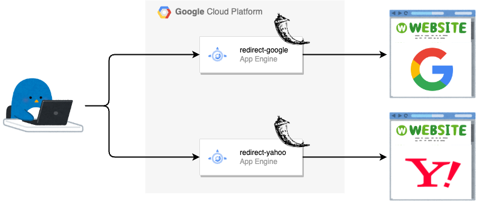

# Hands On Redirect Server on App Engine

## 概要

App Engine でシンプルなリダイレクトサーバを構築するハンズオンです



## 1. App Engine にデプロイ

### 1-1. Flask のソースコードを App Engine にデプロイする

+ 環境変数の設定

```
export _gc_pj_id='Your Google Cloud Project ID'

export _region='asia-northeast1'
```

+ App Engine の有効化をします

```
gcloud app create --region ${_region} --project ${_gc_pj_id}
```

+ `https://www.google.com` にリダイレクトする Flask を App Engine にデプロイする

```
gcloud app deploy redirect-google/app.yaml --project ${_gc_pj_id}
gcloud app browse -s redirect-google --project ${_gc_pj_id}
```

+ `https://www.yahoo.co.jp` にリダイレクトする Flask を App Engine にデプロイする

```
gcloud app deploy redirect-yahoo/app.yaml --project ${_gc_pj_id}
gcloud app browse -s redirect-yahoo --project ${_gc_pj_id}
```

+ Cloud Console からも確認する


### 1-2. App Engine の service の挙動を確認する

+ App Engine の Service の URL を確認する

```
### 例

$ gcloud app browse -s redirect-yahoo --project ${_gc_pj_id}

Did not detect your browser. Go to this link to view your app:
https://redirect-yahoo-dot-{{ Your Google Cloud Project ID }}.an.r.appspot.com
```

+ cURL コマンドで挙動を確認する
  + 301 でリダイレクトを実施してくれている

```
### 例

$ curl -I https://redirect-yahoo-dot-{{ Your Google Cloud Project ID }}.an.r.appspot.com

HTTP/2 301 
content-type: text/html; charset=utf-8
location: https://www.yahoo.co.jp
x-cloud-trace-context: 42249280de62cf2bbecca09bdd9622a4;o=1
content-length: 233
date: Wed, 31 May 2023 21:59:00 GMT
server: Google Frontend
```

## 2. カスタムドメインの設定

[App Engine | Mapping custom domains](https://cloud.google.com/appengine/docs/standard/mapping-custom-domains)

上記を参考にしながらカスタムドメインを設定する
