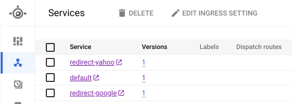

# Hands On App Engine Redirect Server 

## 概要

App Engine でリダイレクトサーバを構築するハンズオン

## 1. App Engine のデプロイ

```
export _gc_pj_id='Your Google Cloud Project ID'
```
```
gcloud app create --region asia-northeast1 --project ${_gc_pj_id}
```
```
gcloud app deploy redirect-google/app.yaml --project ${_gc_pj_id}
gcloud app browse -s redirect-yahoo --project ${_gc_pj_id}


gcloud app deploy redirect-yahoo/app.yaml --project ${_gc_pj_id}
gcloud app browse -s redirect-google --project ${_gc_pj_id}
```




## 2. カスタムドメインの設定

WIP